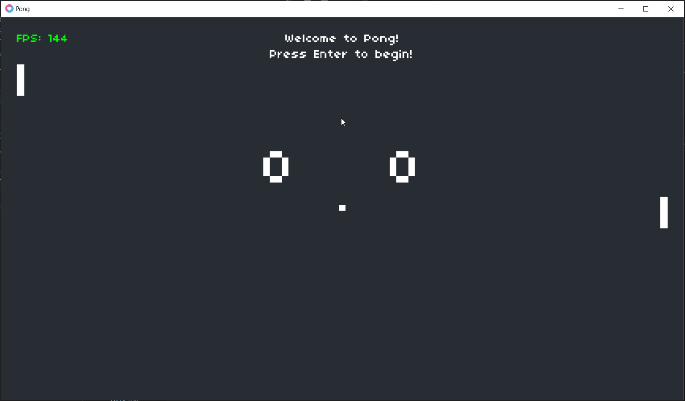

# Pong AI
This is a good old pong game. It is written in Lua with a graphic framework called LOVE2D
___

## Requirements
For it to run you must have the following installed.

1. [Lua](https://www.lua.org/download.html)
2. [LOVE2D](https://love2d.org/)
___

## How to run
To run simple to drag any of the folder, eg `AI Normal` over the `LOVE.exe` file and it will run.

## Gallery
*The gif seems laggy but the game is very smooth*

